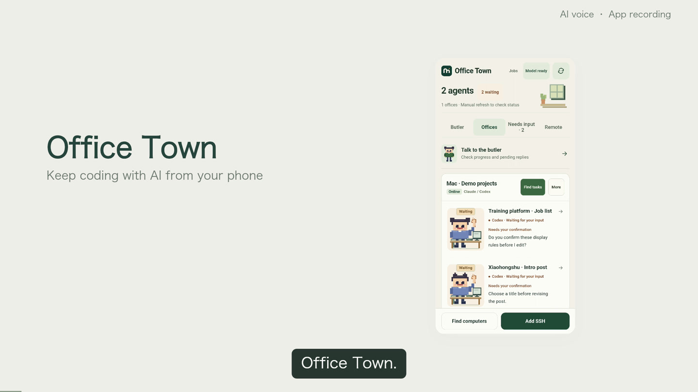
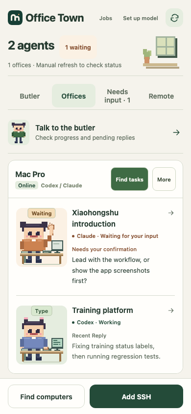
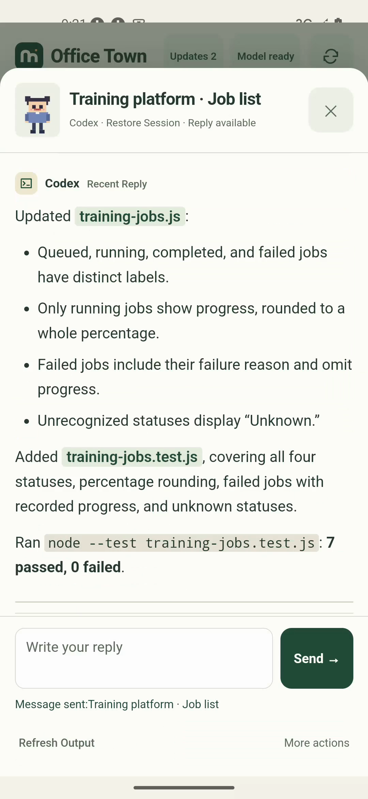
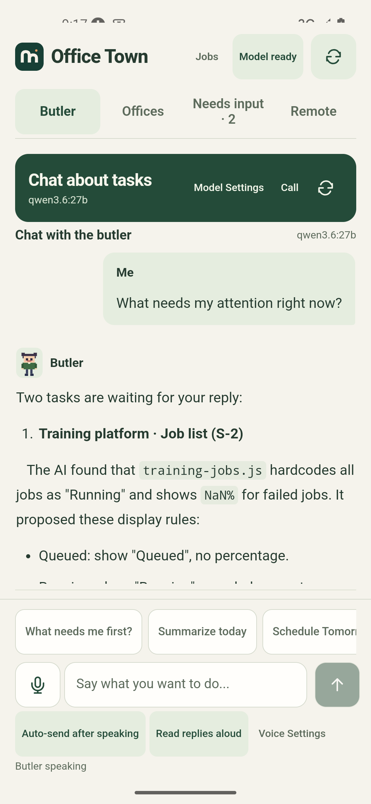
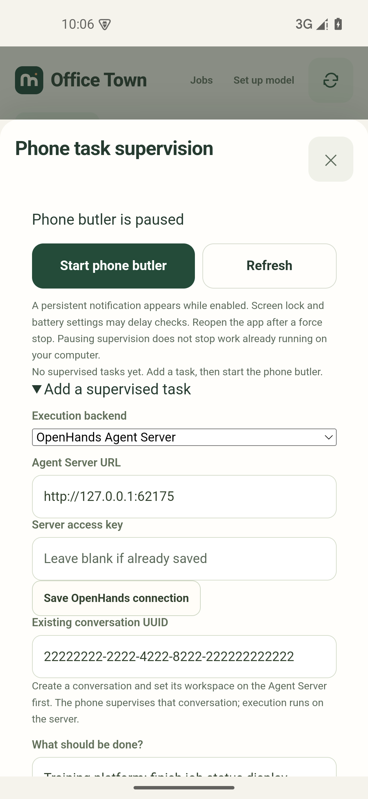
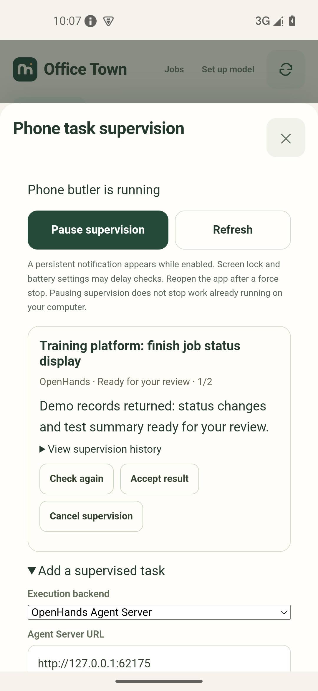

<div align="center">


# agentBridge · Office Town

### Keep coding with AI from your phone

Check Codex and Claude Code progress, add instructions, and keep the original session on your computer moving.<br>
Ask the butler what needs your reply, or let it follow up within limits you set.<br>
Each computer becomes an office; each task gets a pixel employee.

[](https://github.com/otterview-labs/agentBridge/releases/latest)
[](https://github.com/otterview-labs/agentBridge/actions/workflows/ci.yml)
[](https://otterview-labs.github.io/agentBridge/en/)
[](LICENSE)

[中文](README.md) · **English**

[Download page](https://otterview-labs.github.io/agentBridge/en/) · [English APK](https://github.com/otterview-labs/agentBridge/releases/latest/download/agentbridge-en.apk) · [中文 APK](https://github.com/otterview-labs/agentBridge/releases/latest/download/agentbridge-zh.apk)

<a href="https://otterview-labs.github.io/agentBridge/en/?v=20261010-mobile#demo"></a>

[Watch the updated app demo](https://otterview-labs.github.io/agentBridge/en/?v=20261010-mobile#demo) · Add training platform requirements from your phone, read changes and test results, edit a Xiaohongshu draft, then ask the butler to help follow up.

[Download all four videos, subtitles, and narration scripts](https://github.com/otterview-labs/agentBridge/releases/download/android-v0.5.53/office-town-mobile-zh-en.zip). The videos use app recordings and an AI-generated male voice. Follow-up uses controlled demo records; waits have been shortened.

| Office | Task replies | Butler chat | Voice chat |
|:---:|:---:|:---:|:---:|
|  |  |  |  |

<sub>Office, task reply and butler screenshots come from demo projects. The call screenshot uses sample records.</sub>

</div>

## Get started

You need Android 7.0 or later and a Mac or Linux computer reachable over SSH, with an existing Codex or Claude Code session.

### 1. Download the app

[Download the English APK](https://github.com/otterview-labs/agentBridge/releases/latest/download/agentbridge-en.apk), or choose the [Chinese APK](https://github.com/otterview-labs/agentBridge/releases/latest/download/agentbridge-zh.apk). The signed release is about 1.6 MB.

### 2. Connect your computer

Use the LAN scan or enter your computer's SSH address, username, and password or private key.

### 3. Find a task and reply

Find existing sessions, open an employee card, and send a reply. Tap refresh to see new output.

You can set up the butler and voice later. Start by connecting your computer and sending a reply. Follow the [first-use guide](docs/getting-started.en.md) for setup and help with connection, discovery, and butler problems.

## How it works

Tasks keep running on your computers. The app uses SSH to read session records and send messages back to the original Codex or Claude Code session. Your computer needs no agentBridge installation or companion service.

Keep your computer on. Away from your LAN, use a reachable SSH address or your own FRP connection. See the [connection guide](docs/android-app.md#add-a-machine).

Tap refresh for the latest task status. Offline computers show saved records.

## What you can do

- Read output and conversation history while away from your desk, then add instructions or answer the agent's questions.
- Keep tasks from several Mac and Linux computers together, with a separate office for each.
- See which tasks are working, idle, or waiting for input. Tasks needing a reply appear first.
- Ask the butler “Which tasks need my reply?” or “What has this task done recently?” It can refresh tasks, check connections, and read output before answering.
- Choose **Help me reply** on an employee card for drafts based on the last refreshed task records. Select one, edit it, and send it yourself; selecting a draft does not send it.
- Use voice input or an in-app call to ask about progress. Configure the model and test speech recognition and playback first.

Choose your own butler model through an OpenAI-compatible API. Replies stream as they arrive. Chat about the whole town or focus on one employee.

**New in 0.5.53: phone task supervision (experimental).** Set a goal and scope. The butler checks progress and, if you allow it, sends replies within that scope. You set the reply limit and duration. It stops when a decision needs you; you accept the result yourself. Pause at any time. See [setup and limits](docs/managed-mode.md).

<p> </p>

Supervision screenshots use an isolated emulator and controlled demo records.

Town and employee chats have separate Markdown histories. Optional computer-side Pi + `pi-memory` can query tasks and store memory. See [Pi setup](docs/pi-butler.md). Pi chat and phone supervision run separately.

<details>
<summary>Set up butler chat and voice</summary>

Save your provider URL, model name, and API key in model settings, verify the connection, and send a text message.

Then test the microphone and speech playback before starting a call. If system speech services are unavailable, configure Bailian / DashScope cloud speech with a Beijing-region key. Chat and speech can use separate keys. See the [Android guide](docs/android-app.md).

</details>

## Supported tools and editions

| Tool | Current support |
| --- | --- |
| Codex CLI / Codex Desktop sessions | Find sessions, read output and history, send messages |
| Claude Code | Find sessions, read output and history, send messages |
| Gemini CLI | Basic process discovery |
| OpenHands Agent Server (optional) | Observe and message an existing conversation; execution stays on the server |
| Pi + pi-memory (optional) | Computer-side task queries and Markdown memory; separate from phone supervision |

The Chinese **办公小镇** and English **Office Town** apps can be installed together. Each keeps its own settings and records. The Chinese edition updates existing Chinese releases; future English releases update the English app. Original task records retain their language.

Operations such as finding tasks and sending messages can continue after the phone locks, with a notification when they finish or fail.

## Why I’m building Office Town

I often have a few AI sessions open, working on a training platform in one and a Xiaohongshu draft in another. When I leave my computer, I still want to check progress and add instructions so those sessions can continue.

Tasks and records end up spread across tools and computers. After a while, I lose track of where I left off and which session needs a reply. I want to keep that work together and pick it up from my phone.

I also want to spend less time watching tasks whose requirements are already clear. Phone supervision is the first step: set what the butler may do and how many replies it may send, then let it ask when something is uncertain. Code still runs on a computer or in an OpenHands execution environment.

## Supervision limits

Automatic replies are off by default. Start with observation, check the records and model decisions, then allow a narrowly scoped task. A foreground notification stays visible. Battery restrictions, loss of network, or force-stopping the app can interrupt checks; reopen the app to inspect the queue.

OpenHands requires your own Agent Server and an existing conversation. One-click sandbox creation is not available yet. The butler uses recent records and saved chat history, which do not provide the original session’s full context. Keep publishing and payments outside broad task instructions; this release has no automatic Xiaohongshu publishing.

## Data and privacy

Tasks run on the computers you connect. App settings, conversations, and records stay in private app storage on your phone. SSH passwords, private keys, and model credentials are encrypted with Android Keystore and excluded from backups. SSH connections verify saved host keys.

Butler chat sends relevant task information and messages to your chosen model provider. Bailian cloud speech sends audio or playback text to Bailian when enabled. See [SECURITY.md](SECURITY.md).

## Development

Java, Android WebView, JSch / SSH, WebSocket, and Android Service.

Build requirements: JDK 17, Android SDK 35, and Build Tools 35.0.0. Tests also require Node.js 20 or later.

```bash
git clone https://github.com/otterview-labs/agentBridge.git
cd agentBridge/android
./gradlew assembleDebug lintZhDebug lintEnDebug
```

Debug APKs: `android/app/build/outputs/apk/zh/debug/app-zh-debug.apk` and `android/app/build/outputs/apk/en/debug/app-en-debug.apk`. Debug builds use separate application IDs and can coexist with releases.

From the `android` directory, run the tests:

```bash
cd tests
npm ci
npx playwright install chromium
npm test
```

[Report an issue](https://github.com/otterview-labs/agentBridge/issues) or read the [contribution guide](CONTRIBUTING.md).

Licensed under [Apache-2.0](LICENSE).
