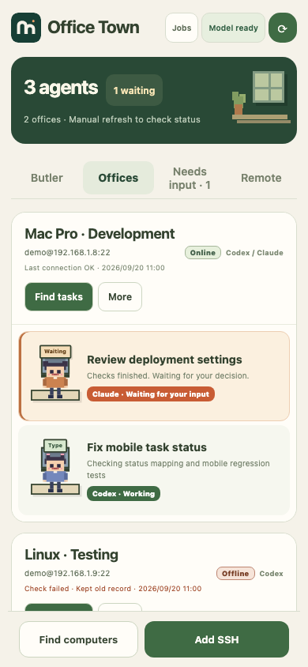
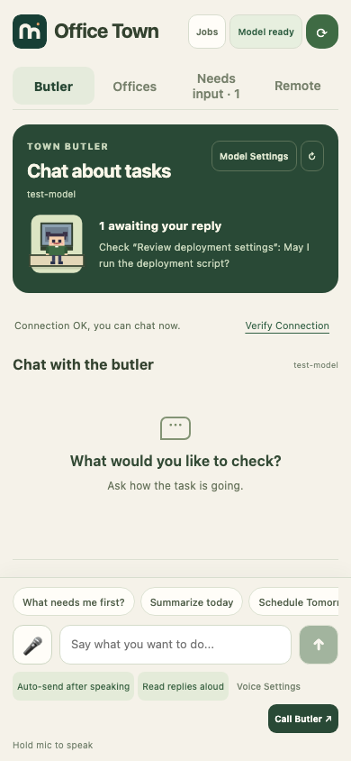
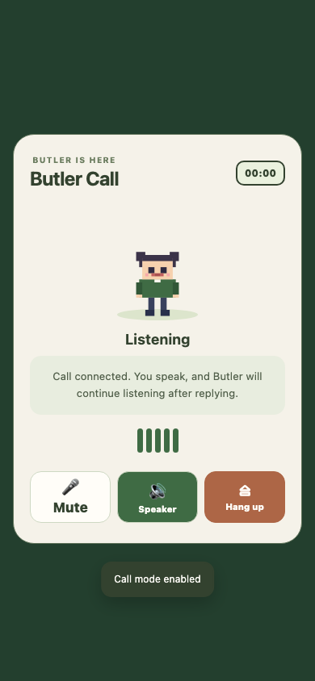

<div align="center">


# agentBridge · Office Town

### Pick up your AI work from your phone.

Read and reply to Codex and Claude Code sessions on Android.<br>
Keep tasks from several computers together. Each computer becomes an office; each task gets a pixel employee.

[](https://github.com/otterview-labs/agentBridge/releases/latest)
[](https://github.com/otterview-labs/agentBridge/actions/workflows/ci.yml)
[](https://otterview-labs.github.io/agentBridge/en/)
[](LICENSE)

[中文](README.md) · **English**

[Download page](https://otterview-labs.github.io/agentBridge/en/) · [English APK](https://github.com/otterview-labs/agentBridge/releases/latest/download/agentbridge-en.apk) · [中文 APK](https://github.com/otterview-labs/agentBridge/releases/latest/download/agentbridge-zh.apk)

| Office | Butler chat | Voice chat |
|:---:|:---:|:---:|
|  |  |  |

<sub>Screenshots use sample records.</sub>

</div>

## Why I’m building Office Town

The more AI tools I use, the more places there are to check. Tasks and records end up spread across sessions and computers. Sometimes I lose track of what got done and what still needs attention.

Office Town brings Codex and Claude Code sessions together. I can read their history, check progress, and reply from my phone while the work continues on my computers.

I also want routine tasks to need less attention. The next step is to let agents plan and handle work within boundaries I set, asking when a decision needs me. Autonomous task management is still planned. Today, the butler can query records, discuss progress, and help draft replies. You send instructions from an employee card.

## What you can do now

- Read output and conversation history, then reply to the original Codex or Claude Code session.
- See which tasks are working, idle, or waiting for input. Tasks needing a reply appear first.
- Check several Mac and Linux computers in one app, with a separate office for each.
- Connect over SSH. Your computer needs no agentBridge installation or companion service.

Tap refresh for the latest task status. Offline computers show saved records.

## Ask the butler

You can ask “Which tasks need my reply?” or “What has this task done recently?” The butler can refresh tasks, check connections, and read output before answering. Configure your own model through an OpenAI-compatible API.

For help writing a reply, choose **Help me reply** on an employee card. Drafts use the last refreshed task records. Select one, edit it, and send it yourself; selecting a draft does not send it.

Voice input and in-app calls are available after speech setup. Verify text chat first, then test recognition and playback before starting a call.

## Get started

You need Android 7.0 or later and a Mac or Linux computer reachable over SSH, with an existing Codex or Claude Code session.

1. [Download the English APK](https://github.com/otterview-labs/agentBridge/releases/latest/download/agentbridge-en.apk) and install it. The signed release is about 1.5 MB.
2. Add your computer using the LAN scan or its SSH address, username, and password or private key.
3. Find tasks, open an employee card, and send a reply. Refresh to see new output.

Keep your computer on. Away from your LAN, use a reachable SSH address or your own FRP connection. See the [Android guide](docs/android-app.md#add-a-machine) for connection details.

For the butler, save your provider URL, model name, and API key in model settings, verify the connection, and send a text message. Then test the microphone and speech playback. If system speech services are unavailable, configure Bailian / DashScope cloud speech with a Beijing-region key. Chat and speech can use separate keys.

## Supported tools and editions

| Tool | Current support |
| --- | --- |
| Codex CLI / Codex Desktop sessions | Find sessions, read output and history, send messages |
| Claude Code | Find sessions, read output and history, send messages |
| Gemini CLI | Basic process discovery |

The Chinese **办公小镇** and English **Office Town** apps can be installed together. Each keeps its own settings and records. The Chinese edition updates existing Chinese releases; future English releases update the English app. Original task records retain their language.

Operations such as finding tasks and sending messages can continue after the phone locks, with a notification when they finish or fail.

## Data and privacy

Tasks run on the computers you connect. App settings, conversations, and records stay in private app storage on your phone. SSH passwords, private keys, and model credentials are encrypted with Android Keystore and excluded from backups. SSH connections verify saved host keys.

Butler chat sends relevant task information and messages to your chosen model provider. Bailian cloud speech sends audio or playback text to Bailian when enabled. See [SECURITY.md](SECURITY.md).

## Development

Java, Android WebView, JSch / SSH, WebSocket, and Android Service.

Build requirements: JDK 17, Android SDK 35, and Build Tools 35.0.0. Tests also require Node.js 20 or later.

```bash
git clone https://github.com/otterview-labs/agentBridge.git
cd agentBridge/android
./gradlew assembleDebug lintZhDebug lintEnDebug
```

Debug APKs: `android/app/build/outputs/apk/zh/debug/app-zh-debug.apk` and `android/app/build/outputs/apk/en/debug/app-en-debug.apk`. Debug builds use separate application IDs and can coexist with releases.

From the `android` directory, run the tests:

```bash
cd tests
npm ci
npx playwright install chromium
npm test
```

[Report an issue](https://github.com/otterview-labs/agentBridge/issues) or read the [contribution guide](CONTRIBUTING.md).

Licensed under [Apache-2.0](LICENSE).
