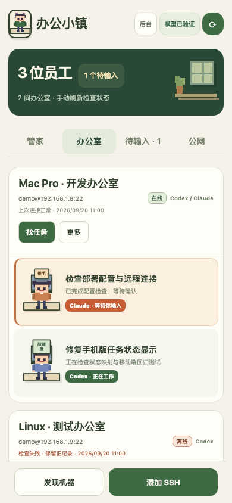
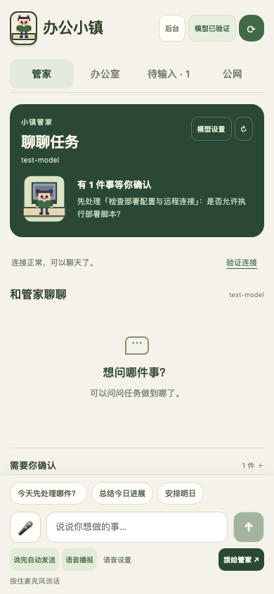

<div align="center">


# agentBridge · 办公小镇

### Codex 和 Claude Code 的安卓遥控器

电脑上跑任务，手机上接着聊。<br>
每台电脑一间办公室，每个任务一位像素员工。

[](https://github.com/otterview-labs/agentBridge/releases/latest)
[](https://github.com/otterview-labs/agentBridge/actions/workflows/ci.yml)
[](https://otterview-labs.github.io/agentBridge/)
[](LICENSE)

**[下载安卓版](https://otterview-labs.github.io/agentBridge/)** · [直接下载 APK](https://github.com/otterview-labs/agentBridge/releases/latest/download/agentbridge.apk) · [快速开始](#快速开始) · [使用文档](docs/android-app.md)

| 像素办公室 | 管家聊天 | 语音通话 |
|:---:|:---:|:---:|
|  |  |  |

<sub>截图使用样例记录。</sub>

</div>

## 离开电脑，继续手上的任务

Codex 在改代码，Claude 在查问题，你要出门了。用 agentBridge 打开电脑上的会话，读它刚才的输出、补充要求，或者回答它的问题。消息回到原会话，任务继续在你的电脑上执行。

- **接着原会话聊。** 读取 Codex、Claude Code 的输出和对话记录，在手机上发送消息。
- **把任务放进像素办公室。** 正在工作、空闲、等你输入，都有对应的员工状态。需要回复的任务排在前面，点开卡片就能处理。
- **几台电脑，一起看。** Mac、Linux 各有自己的办公室，任务集中在同一个 App 里。
- **手机直连电脑。** 通过 SSH 连接现有会话，电脑端无需安装 agentBridge 或部署配套服务。

任务状态在点击刷新后更新；离线电脑显示的是历史记录。

## 找管家聊任务

想先了解进展，可以直接问管家：

> 哪些任务需要我回复？<br>
> 这个任务最近做了什么？

管家可以刷新任务、检查电脑连接、读取输出，再根据查到的内容回答。模型由你选择，支持 OpenAI 兼容接口。

不知道怎么回员工时，点卡片里的「帮我写回复」，让模型根据该任务的记录写几条草稿。选一条，改好后发送。管家负责查记录和讨论，给员工的指令由你在卡片里发出。

也可以用语音聊：按住说话，或打开「拨给管家」，通过 App 内的语音通话询问进展。使用前需要配置模型，并测试语音识别和播报。

## 快速开始

**需要：** Android 7.0+ 手机，以及一台能通过 SSH 连接、已有 Codex 或 Claude Code 会话的 Mac / Linux 电脑。

1. **[下载并安装 APK](https://github.com/otterview-labs/agentBridge/releases/latest/download/agentbridge.apk)。** 安装包约 1.5 MB，旧正式版可覆盖更新。
2. **添加电脑。** 在 App 中点「发现机器」扫描局域网，或填写 SSH 地址、账号和密码／私钥。
3. **点「找任务」。** 打开员工卡片查看输出，发送消息后刷新进展。

电脑需要保持开机。局域网内可以直接连接；在外使用需要可访问的 SSH 地址，也可以配置自己的 FRP 入口。连接配置见 [使用文档](docs/android-app.md#add-a-machine)。

<details>
<summary><strong>配置管家聊天和语音</strong></summary>

在「管家 → 配置模型」填写服务商地址、模型名和 API Key，保存后点「验证连接」，再发一条文字消息。

文字聊天成功后，单独测试麦克风识别和声音播报，再打开「拨给管家」。系统语音服务不可用时，可配置百炼北京地域的云端语音服务。具体配置见 [使用文档](docs/android-app.md)。

</details>

## 支持范围

| 工具 | 当前支持 |
| --- | --- |
| Codex CLI / Codex Desktop 会话 | 发现会话、读取输出、发送消息、查看对话记录 |
| Claude Code | 发现会话、读取输出、发送消息、查看对话记录 |
| Gemini CLI | 基础进程发现 |

目前提供安卓版，界面和语音以中文为主。发送消息、查找任务等操作在开始后可继续在锁屏下执行，完成或失败时通知你。

## 数据与隐私

任务在你连接的电脑上执行。App 的配置、对话和记录保存在手机应用私有存储；SSH 密码、私钥、模型密钥等凭据使用 Android Keystore 加密，并从备份中排除。SSH 连接会核对已保存的主机密钥。

使用管家时，必要的任务信息和对话会发送到你选择的模型服务；启用百炼云端语音时，录音或播报文字会发送到百炼。详情见 [安全说明](SECURITY.md)。

## 开发与贡献

Java · Android WebView · JSch / SSH · WebSocket · Android Service。

需要 JDK 17、Android SDK 35、Build Tools 35.0.0；运行测试还需要 Node.js 20+。

```bash
git clone https://github.com/otterview-labs/agentBridge.git
cd agentBridge/android
./gradlew assembleDebug lintDebug
```

调试安装包：`android/app/build/outputs/apk/debug/app-debug.apk`。调试版与正式版使用不同的应用 ID，可同时安装。

在 `android` 目录下运行测试：

```bash
cd tests
npm ci
npx playwright install chromium
npm test
```

反馈问题或提出功能建议：[提交 Issue](https://github.com/otterview-labs/agentBridge/issues)。参与开发请阅读 [贡献指南](CONTRIBUTING.md)。

[Apache-2.0](LICENSE) 许可证。

---

**An Android remote for Codex and Claude Code, with a pixel-art office.** Connect to your own Mac or Linux machine over SSH, read output, and reply to existing sessions. Machines become offices; tasks become employees. An optional AI butler can look up task information, discuss progress, and draft replies using your model provider. Voice chat requires separate speech setup. The app currently focuses on Chinese UI and speech.
