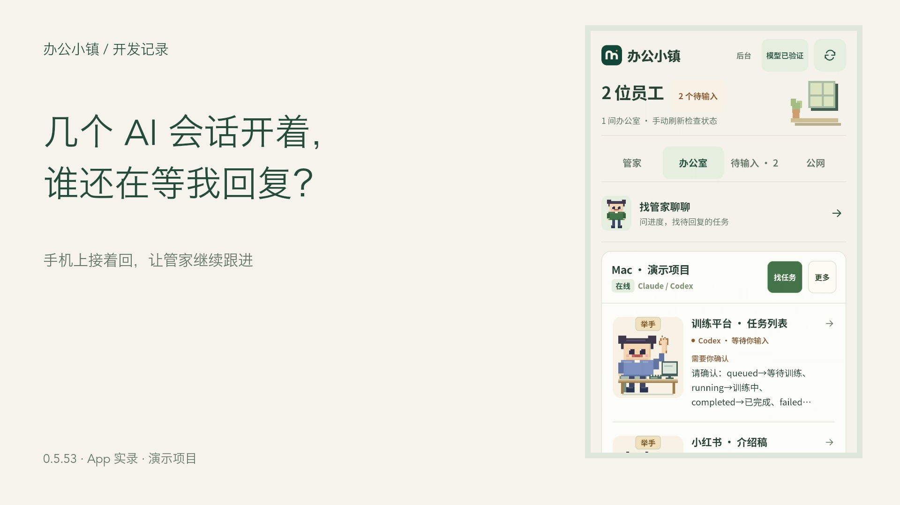
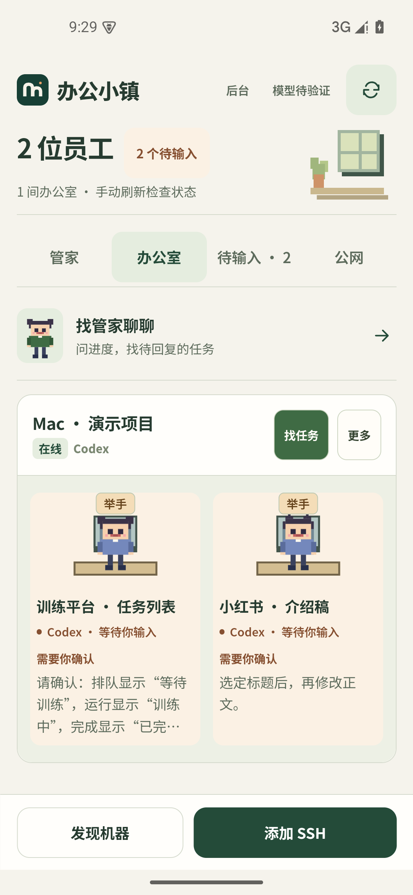
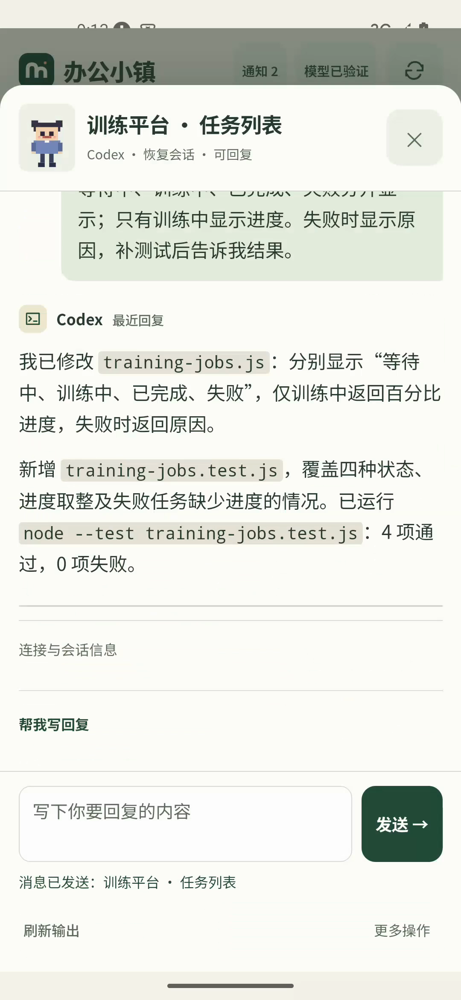
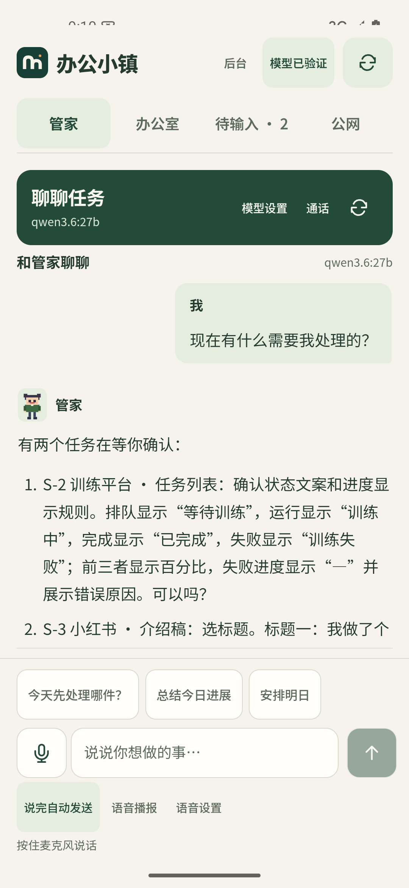

<div align="center">


# agentBridge · 办公小镇

### 在手机上接着处理 Codex 和 Claude Code 的任务

在手机上查看输出、翻记录，接着电脑上的会话回消息。<br>
让管家查进展、帮你写回复，也可以按你定的范围继续跟进。<br>
每台电脑一间办公室，每个任务一位像素员工。

[](https://github.com/otterview-labs/agentBridge/releases/latest)
[](https://github.com/otterview-labs/agentBridge/actions/workflows/ci.yml)
[](https://otterview-labs.github.io/agentBridge/)
[](LICENSE)

[中文](README.md) · **[English README](README.en.md)**

[下载页](https://otterview-labs.github.io/agentBridge/) · [English download page](https://otterview-labs.github.io/agentBridge/en/) · [中文 APK](https://github.com/otterview-labs/agentBridge/releases/latest/download/agentbridge-zh.apk) · [English APK](https://github.com/otterview-labs/agentBridge/releases/latest/download/agentbridge-en.apk)

<a href="https://otterview-labs.github.io/agentBridge/#demo"></a>

**[看中英文操作视频](https://otterview-labs.github.io/agentBridge/#demo)** · 开发训练平台、修改小红书介绍稿，用手机接着回复 Codex。

| 像素办公室 | 任务回复 | 管家聊天 | 语音通话 |
|:---:|:---:|:---:|:---:|
|  |  |  |  |

<sub>办公室、任务回复和管家截图来自演示项目；通话截图使用样例记录。</sub>

</div>

## 开始使用

需要 Android 7.0+ 手机，以及一台能通过 SSH 连接、已有 Codex 或 Claude Code 会话的 Mac / Linux 电脑。

### 1. 下载 App

[下载中文 APK](https://github.com/otterview-labs/agentBridge/releases/latest/download/agentbridge.apk)，或选择 [English APK](https://github.com/otterview-labs/agentBridge/releases/latest/download/agentbridge-en.apk)。安装包约 1.6 MB。

### 2. 连接电脑

打开 App，点「发现机器」扫描局域网，或填写 SSH 地址、账号和密码／私钥。

### 3. 找到任务，接着回复

点「找任务」，导入电脑上已有的会话。打开员工卡片看输出、发消息，再点击刷新查看进展。

管家聊天和语音可以之后再配置，先连上电脑、发出第一条回复。照着 [首次使用指南](docs/getting-started.zh.md) 操作；连接、找任务或管家配置卡住时，里面有对应的排查步骤。

## 怎么连接电脑上的任务

任务继续在你的电脑上执行。手机通过 SSH 读取会话记录、发送消息，电脑端无需安装 agentBridge 或部署配套服务。回复会发回原来的 Codex 或 Claude Code 会话。

电脑需要保持开机。局域网内可以直接连接；在外使用需要可访问的 SSH 地址，也可以配置自己的 FRP 入口。连接配置见 [使用文档](docs/android-app.md#add-a-machine)。

任务状态在点击刷新后更新；离线电脑显示的是历史记录。

## 可以用它做什么

- 离开电脑后，读任务输出和对话记录，补充要求或回答 AI 的问题。
- 把几台 Mac、Linux 电脑的任务放在一起，每台电脑各有自己的办公室。
- 在像素办公室里看哪些任务正在工作、空闲或等你输入。需要回复的任务排在前面。
- 让管家查哪些任务需要回复、某个任务最近做了什么。它可以刷新任务、检查电脑连接、读取输出，再根据查到的内容回答。
- 不知道怎么回员工时，点「帮我写回复」。模型根据最近一次刷新的记录写几条草稿，你选一条、改好后发送，选中不会自动发出去。
- 按住说话，或用「拨给管家」通过 App 内的语音通话询问进展。使用前需要配置模型，并测试语音识别和播报。

管家模型由你选择，支持 OpenAI 兼容接口。聊天回复逐步显示；可以查看整个小镇，也可以只聊某位员工的任务。

**0.5.53：手机持续跟进（试用）**。把目标和处理范围交代清楚，管家会检查进展；允许自动回复后，它可以在这个范围内发消息。回复次数和跟进时长由你设置，遇到需要决定的事会停下来。结果由你确认，随时可以暂停。见[使用与限制](docs/managed-mode.md)。

聊天记录按小镇和员工分别保存在 Markdown 文件里；可选的电脑端 Pi + `pi-memory` 可以查询任务、保存记忆。配置见 [Pi 管家说明](docs/pi-butler.md)。Pi 聊天和手机持续跟进分别运行。

<details>
<summary>配置管家聊天和语音</summary>

在「管家 → 配置模型」填写服务商地址、模型名和 API Key，保存后点「验证连接」，再发一条文字消息。

文字聊天成功后，单独测试麦克风识别和声音播报，再打开「拨给管家」。系统语音服务不可用时，可配置百炼北京地域的云端语音服务。具体配置见 [使用文档](docs/android-app.md)。

</details>

## 支持的工具

| 工具 | 当前支持 |
| --- | --- |
| Codex CLI / Codex Desktop 会话 | 发现会话、读取输出、发送消息、查看对话记录 |
| Claude Code | 发现会话、读取输出、发送消息、查看对话记录 |
| Gemini CLI | 基础进程发现 |
| OpenHands Agent Server（可选） | 绑定已有会话，查询进展、发送跟进消息；执行环境在服务端 |
| Pi + pi-memory（可选） | 电脑端管家查询与 Markdown 记忆；与手机跟进队列分别运行 |

目前提供中文「办公小镇」和英文「Office Town」两款安卓版，可以同时安装。中文版沿用原应用 ID，可覆盖旧正式版；两款 App 的配置和记录各自保存。发送消息、查找任务等操作在开始后可继续在锁屏下执行，完成或失败时通知你。

## 为什么做办公小镇

用的 AI 工具多了，任务和记录也散得到处都是。做过什么、哪件事还没结束，有时候自己都记不清。我想先有个地方，把几台电脑上的任务和记录放在一起。

还有一些事，要求已经说清楚了，AI 本来就能接着处理，我不想每个任务都一直盯着。现在先做了手机持续跟进：规定它能做什么、最多回复几次，拿不准时停下来问我。代码仍在电脑或 OpenHands 的执行环境里运行。

## 持续跟进的边界

自动回复默认关闭。第一次建议只开启观察，确认记录和模型判断合适后，再授权一个小范围的任务。手机会显示常驻通知；省电设置、断网、应用被强制停止可能中断跟进，重新打开后可查看队列。

OpenHands 需要自己配置 Agent Server 和已有会话，目前还不能一键创建开发环境。手机保存近期记录和聊天历史，管家并不拥有原会话的全部上下文。发布、付款等操作不要混在宽泛的任务目标里；本版也没有小红书自动发布功能。

## 数据与隐私

任务在你连接的电脑上执行。App 的配置、对话和记录保存在手机应用私有存储；SSH 密码、私钥、模型密钥等凭据使用 Android Keystore 加密，并从备份中排除。SSH 连接会核对已保存的主机密钥。

使用管家时，必要的任务信息和对话会发送到你选择的模型服务；启用百炼云端语音时，录音或播报文字会发送到百炼。详情见 [安全说明](SECURITY.md)。

## 开发与贡献

Java · Android WebView · JSch / SSH · WebSocket · Android Service。

需要 JDK 17、Android SDK 35、Build Tools 35.0.0；运行测试还需要 Node.js 20+。

```bash
git clone https://github.com/otterview-labs/agentBridge.git
cd agentBridge/android
./gradlew assembleDebug lintZhDebug lintEnDebug
```

调试安装包：`android/app/build/outputs/apk/zh/debug/app-zh-debug.apk` 和 `android/app/build/outputs/apk/en/debug/app-en-debug.apk`。调试版与正式版使用不同的应用 ID，可同时安装。

在 `android` 目录下运行测试：

```bash
cd tests
npm ci
npx playwright install chromium
npm test
```

反馈问题或提出功能建议：[提交 Issue](https://github.com/otterview-labs/agentBridge/issues)。参与开发请阅读 [贡献指南](CONTRIBUTING.md)。

[Apache-2.0](LICENSE) 许可证。

---

Read the [English README](README.en.md) for features, setup, and development instructions.
